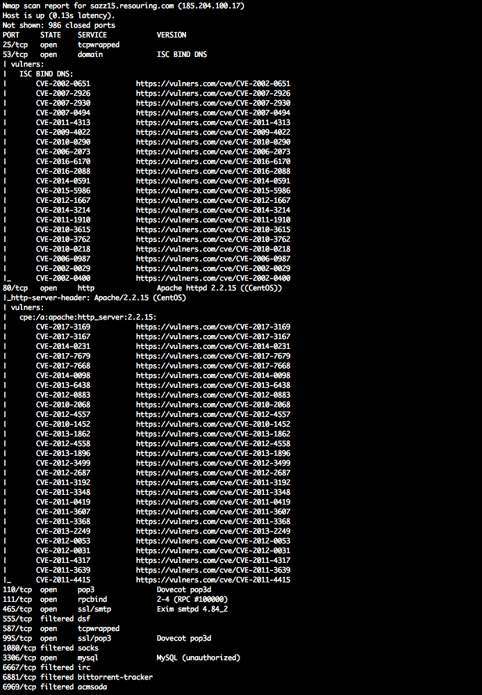

# nmap_vulners

 

## Description

NSE script using some well-known service to provide info on vulnerabilities

## Dependencies:
     nmap libraries:
         http
         json
         string

The only thing you should always keep in mind is that the script depends on having software versions at hand, so it only works with -sV flag.

## Installation
     locate, where your nmap scripts are located in your system
         for *nix system it might be  ~/.nmap/scripts/ or $NMAPDIR
         for Mac it might be /usr/local/Cellar/nmap/<version>/share/nmap/scripts/
         for Windows you have to find it yourself
     copy the provided script (vulners.nse) into that directory

## Usage
    Use it as straightforward as you can:
        nmap -sV --script vulners <target>
        
It is KISS after all.
