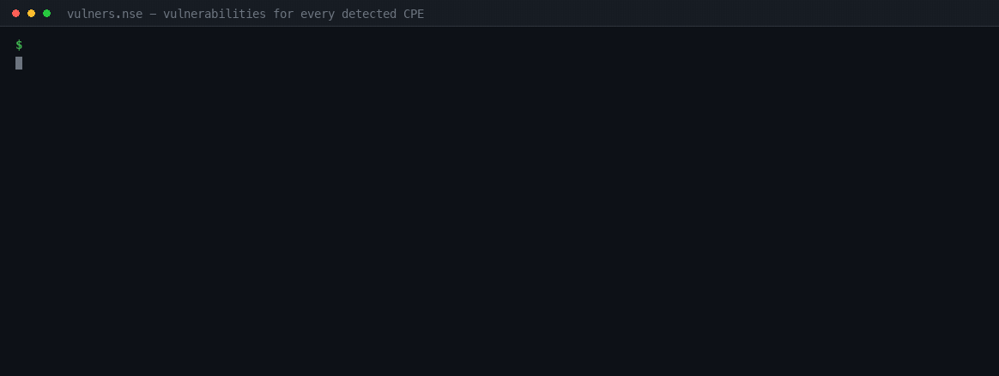
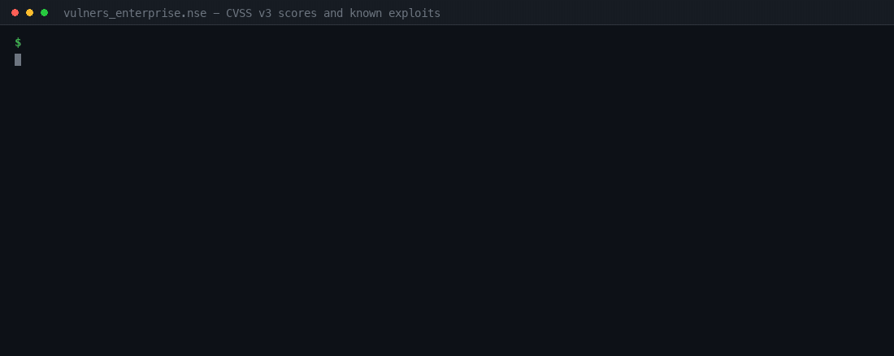
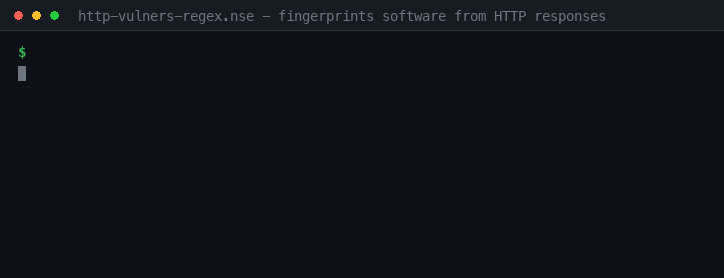

<div align="center">

# nmap-vulners

**Turn an nmap service scan into a list of CVEs, CVSS scores and known exploits.**

Three NSE scripts that take the software nmap already identified, ask the
[Vulners](https://vulners.com) database what is known about it, and print the
answer inside the scan report.

[](https://github.com/vulnersCom/nmap-vulners/actions)
[](LICENSE)
[](https://nmap.org)
[](https://vulners.com)
[](https://github.com/vulnersCom/nmap-vulners/stargazers)

</div>



---

## The three scripts

| Script | Needs a key | What it does |
|---|---|---|
| [`vulners.nse`](vulners.nse) | no | Sends every CPE nmap found to the public Vulners endpoint and prints what is known about it, highest CVSS first |
| [`vulners_enterprise.nse`](vulners_enterprise.nse) | yes | The same lookup through the Vulners API v4: CVSS v3 scores and the exploits that reference each CVE |
| [`http-vulners-regex.nse`](http-vulners-regex.nse) | no | Fingerprints web software from HTTP headers and page content, so the other two have something to look up even when `-sV` cannot name it |

They are independent. Run one, or run all three - the regex script hands its
findings to the other two automatically.

## Install

**macOS, Linux, Kali, WSL** - one line, no arguments:

```sh
curl -fsSL https://raw.githubusercontent.com/vulnersCom/nmap-vulners/master/install.sh | sh
```

**Windows** - PowerShell as Administrator:

```powershell
irm https://raw.githubusercontent.com/vulnersCom/nmap-vulners/master/install.ps1 | iex
```

The installer asks nmap where it keeps its data, copies the scripts and their
data files there, rebuilds the script database, and then checks that
`--script vulners` really resolves to what it just installed - nmap ships a
`vulners.nse` of its own, and this replaces it.

<details>
<summary><b>Without root, and other options</b></summary>

```sh
# into ~/.nmap, no sudo; the installer prints the NMAPDIR line to add to your profile
curl -fsSL https://raw.githubusercontent.com/vulnersCom/nmap-vulners/master/install.sh | sh -s -- --user

# a specific directory
./install.sh --prefix /usr/local/share/nmap

# a specific release
./install.sh --ref v1.5

# remove everything it installed
./install.sh --uninstall
```

PowerShell takes the same options: `-User`, `-Prefix`, `-Ref`, `-Uninstall`.

</details>

<details>
<summary><b>From a checkout</b></summary>

```sh
git clone https://github.com/vulnersCom/nmap-vulners
cd nmap-vulners
./install.sh
```

The installer uses the files next to it, so this installs exactly what you
cloned. Running the scripts straight out of the checkout works too:

```sh
nmap -sV --script "$PWD/vulners.nse" <target>
```

> Use an **absolute** path when running from a checkout. nmap resolves a
> relative `--script ./vulners.nse` against its own `script.db` first, and
> quietly runs the copy that shipped with nmap instead of yours.

</details>

<details>
<summary><b>By hand</b></summary>

Five files, two directories:

| File | Goes to |
|---|---|
| `vulners.nse`, `vulners_enterprise.nse`, `http-vulners-regex.nse` | `<nmap data dir>/scripts/` |
| `http-vulners-regex.json`, `http-vulners-paths.txt` | `<nmap data dir>/nselib/data/` |

Then `sudo nmap --script-updatedb`.

The nmap data directory is usually `/usr/share/nmap` (Debian, Ubuntu, Kali),
`/usr/local/share/nmap` (built from source), `/opt/homebrew/share/nmap`
(Homebrew) or `C:\Program Files (x86)\Nmap` (Windows). To be certain, ask nmap:

```sh
nmap -d2 --script-help probe 2>&1 | grep nse_main.lua
```

The directory holding `nse_main.lua` is the one this nmap uses.

</details>

## Usage

### vulners - no key required

```sh
nmap -sV --script vulners [--script-args mincvss=<score>] <target>
```

Every CPE nmap reports is looked up; each vulnerability is printed with its
score, the scale that score is on, and a link. Entries with a known exploit are
marked `*EXPLOIT*` and are shown whatever the threshold, because an exploited
low-severity bug still gets you owned.

### vulners_enterprise - Vulners API key

```sh
export VULNERS_API_KEY=<token>
nmap -sV --script vulners_enterprise [--script-args mincvss=<score>] <target>
```



The enterprise endpoint answers with CVSS v3 metrics and with the exploit
references Vulners has collected, so an exploited CVE is marked
`*HAS EXPLOIT*` and the exploit itself is listed next to it. All the CPEs of a
port travel in **one** request.

### http-vulners-regex - fingerprint what -sV cannot name

```sh
nmap -sV --script http-vulners-regex [--script-args paths={"/"}] <target>
```



178 patterns map HTTP headers and page markup - `Server`, `X-Powered-By`,
generator tags, asset URLs - onto CPEs: web servers, CMSs, frameworks,
WordPress plugins, JavaScript libraries. Whatever it finds is published to the
port, so `vulners` and `vulners_enterprise` look it up in the same scan.

## Script arguments

### vulners

| Argument | Default | Meaning |
|---|---|---|
| `vulners.mincvss` | `0` | Hide vulnerabilities scored below this. Unscored bulletins and exploits are always shown |
| `vulners.api_host` | `vulners.com` | Host name of the API |
| `vulners.api_port` | `443` | Port on `api_host` |

### vulners_enterprise

| Argument | Default | Meaning |
|---|---|---|
| `vulners_enterprise.mincvss` | `0` | As above |
| `vulners_enterprise.api_key` | - | API token. Prefer the environment variable, see below |
| `vulners_enterprise.api_key_file` | - | Absolute path to a file whose first line is the token |
| `vulners_enterprise.api_host` | `vulners.com` | Host name of the API |
| `vulners_enterprise.api_port` | `443` | Port on `api_host` |

### http-vulners-regex

| Argument | Default | Meaning |
|---|---|---|
| `http-vulners-regex.paths` | `http-vulners-paths.txt` (125 paths) | A Lua list of paths, or one string naming a file with one path per line |

The whole path list travels in a single HTTP pipeline. A file that cannot be
read stops the script rather than falling back to the shipped list, so a typo in
the file name cannot turn a three-path scan into a 125-path one.

## Where to keep the API key

In order of preference:

1. `VULNERS_API_KEY` in the environment
2. `--script-args vulners_enterprise.api_key_file=/absolute/path`
3. `--script-args vulners_enterprise.api_key=<token>`

The third is convenient and leaky: nmap copies its own command line into every
report, so the token ends up in the `args` attribute of `-oX` output and in your
shell history. The script itself never writes the token anywhere, including its
debug output - there is a regression test that says so.

Tokens live in your [vulners.com](https://vulners.com) account. Without one,
`vulners_enterprise` stays silent and sends nothing.

## How the three fit together

```
nmap -sV
   |
   +-- service fingerprint --> port.version.cpe ------------+
   |                                                        |
   +-- http-vulners-regex.nse                               |
         requests the path list in one pipeline             |
         matches headers and bodies against 178 patterns    |
         publishes the CPEs it found for that port ---------+
                                                            |
                                                            v
                                     vulners.nse / vulners_enterprise.nse
                                        one batched request per port
                                        answers cached for the whole scan
                                        sorted by CVSS, exploits marked
```

## Machine-readable output

Everything the scripts print is also structured, so `-oX` output can be parsed
without touching the human text:

```xml
<script id="vulners_enterprise">
  <table key="cpe:/a:apache:http_server:2.4.7">
    <table>
      <elem key="id">CVE-2021-44790</elem>
      <elem key="type">cve</elem>
      <elem key="cvss">9.8</elem>
      <elem key="cvss_type">cvss3.1</elem>
    </table>
    <table>
      <elem key="id">EDB-ID:51193</elem>
      <elem key="type">exploitdb</elem>
      <elem key="cvss">9.8</elem>
      <elem key="cvss_type">cvss3.1</elem>
      <elem key="is_exploit">true</elem>
    </table>
  </table>
</script>
```

The keys are `id`, `type`, `cvss`, `cvss_type` and `is_exploit`, which is present
only on entries that have one. Result tables are keyed by the CPE they were found
for. An unscored bulletin carries neither `cvss` nor `cvss_type`.

## Scanning politely

A scan of a network asks the API far less than it looks:

* every CPE of a port goes into **one** batched request
* answers are cached for the whole scan, so a hundred identical servers cost one
  lookup, not a hundred
* a lookup already in flight is waited for rather than repeated
* the 125-path sweep runs over **5 TCP connections** rather than 126, and asks
  for compressed pages where the server offers them
* a rate limit or an outage stops the scan's requests instead of retrying per
  host

## Development

The tests, the hygiene gate and `CONTRIBUTING.md` are in the git repository
only; the release archive ships the scripts and their data. Three gates, all
offline except where noted:

```sh
nmap -sn -Pn --script ./tests/run.nse --script-args testdir=tests,root=. 127.0.0.1
python3 tests/e2e/run_e2e.py
python3 tools/check.py
```

110 unit cases run inside nmap against the real NSE libraries; 33 end-to-end
cases drive the real nmap binary against a local web server and a stand-in
Vulners API; the hygiene gate keeps secrets, scan output and editor clutter out
of the tree. `python3 tests/e2e/run_e2e.py --live` adds six checks against the
real service. See [CONTRIBUTING.md](CONTRIBUTING.md).

## FAQ

**Does it exploit anything?** No. The scripts read banners and pages and ask a
database. They are in nmap's `safe` category.

**Does it work without an API key?** Yes - `vulners` and `http-vulners-regex`
need none. `vulners_enterprise` does.

**Why does a vulnerability show `cvss2.0` while another shows `cvss3.1`?** The
label names the scale the score is on. Vulners returns whichever the source
published; a v2 score of 9.3 is not a v3 score of 9.3.

**Why is a low-scoring entry shown when I set `mincvss`?** Because it has a
known exploit, or because the source never scored it. Both are deliberate.

**It found nothing on a host I know is vulnerable.** Run with `-d2`: the scripts
log every CPE they asked about. Usually nmap named the service but not its
version, and there is no version to look up.

## License

The scripts are licensed the same as Nmap itself - see [LICENSE](LICENSE) for the
Nmap Public Source License, and
[nmap.org/npsl](https://nmap.org/npsl/) for what it means.

Vulnerability data comes from [Vulners](https://vulners.com) and is subject to
their terms.

## Related

* [vulners.com](https://vulners.com) - the database behind these scripts
* [vulnersCom/api](https://github.com/vulnersCom/api) - the Python client
* [vulnersCom/burp-vulners-scanner](https://github.com/vulnersCom/burp-vulners-scanner) - the same data inside Burp Suite
* [nmap.org/book/nse.html](https://nmap.org/book/nse.html) - how NSE scripts work

---

<div align="center">

Maintained by the Vulners Team &lt;info@vulners.com&gt;

`#nmap` `#nse` `#vulnerability-scanner` `#cve` `#cvss` `#cpe` `#vulners`
`#security-tools` `#pentest` `#infosec` `#network-scanner` `#exploit-database`
`#lua` `#vulnerability-detection` `#security-automation`

</div>
